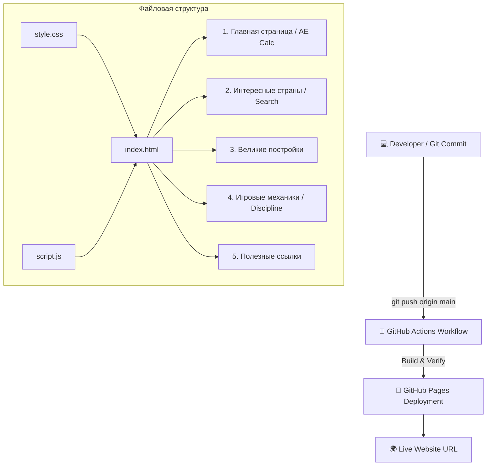

# 👑 ★ EUROPA UNIVERSALIS IV — WIKI ZONE ★

> **GREETINGS, MY LIEGE!** ⚔️
> Вы вступили на земли грандиозной базы знаний по Europa Universalis IV. Anno Domini 1444.

```text
╔════════════════════════════════════════════════════════════════╗
║                     PAX  PARADOXICA  1444                      ║
╠════════════════════════════════════════════════════════════════╣
║                                                                ║
║     🏰  MAP  •  DIPLOMACY  •  WARFARE  •  MONUMENTS  🏰        ║
║                                                                ║
║               "Comet Sighted! (-1 Stability)"                  ║
║                                                                ║
║         Best viewed in 1920x1080 (or on a map of Europe)       ║
║                                                                ║
╚════════════════════════════════════════════════════════════════╝
```

## 📜 Что это за проект?

Это статический сайт-база знаний по **EU4**, созданный в рамках индивидуального учебного проекта с автодеплоем через **CI/CD** на **GitHub Pages**.

Сайт работает на:
- 🧱 **HTML5** (Семантическая верстка)
- 🎨 **CSS3** (Адаптив, средневековый стиль и плавная анимация)
- ⚡ **JavaScript** (Интерактив, калькуляторы, фильтры страниц)
- 🤖 **GitHub Actions** (Автоматический CI/CD деплой)
- 🚀 **GitHub Pages** (Хостинг)

---

## 🌐 LIVE WEBSITE

🚀 **Завоевать мир можно по этой ссылке:**

👉 **https://Belka9823.github.io/EU4-indie-guide/**

```text
╭────────────────────────────────────────────────────────╮
│  🏰 YOU ARE CURRENTLY RULING THE EMPIRE                │
│                                                        │
│  ★ PRESTIGE: +100  │  MANA: 999  │  STABILITY: +3 ★     │
╰────────────────────────────────────────────────────────╯
```

*(Замените ссылку выше на ваш реальный URL после деплоя!)*

---

## 🏛️ Структура сайта (5 Разделов)

В соответствии с заданием, сайт разделен на **5 полноценных страниц/разделов**:

1. 🏠 **Главная:** Вводная информация и **Калькулятор Агрессивного Расширения (AE)**.
2. 🚩 **Интересные страны:** Интерактивный каталог из 12 государств с поиском и бейджами сложности.
3. 🗿 **Великие постройки:** База монументов и памятников (Альгамбра, Собор Св. Софии и др.).
4. ⚔️ **Игровые механики:** **Калькулятор Дисциплины армии** и гайд по торговле.
5. 🔗 **Полезные ссылки:** Ссылки на официальную Wiki, Steam, Reddit и моды.

---

## 📐 Структура проекта (Mermaid Diagram)



---

## 📁 Дерево файлов

```text
eu4-wiki-project/
│
├── .github/
│   └── workflows/
│       └── deploy.yml      # Настройки CI/CD автодеплоя
│
├── index.html              # Разметка всех 5 страниц
├── style.css               # Стили, цвета и hover-анимации
├── script.js              # Логика калькуляторов и фильтра
└── README.md               # Документация проекта
```

---

## 🤖 CI/CD Workflow

Проект использует **GitHub Actions** для автоматического обновления сайта при каждом пуше в ветку `main`:

```text
       GIT PUSH
          │
          ▼
┌──────────────────┐
│  GitHub Actions  │
│  Trigger Build   │
└────────┬─────────┘
         ▼
┌──────────────────┐
│ Upload Artifact  │
└────────┬─────────┘
         ▼
┌──────────────────┐
│  GitHub Pages    │
│    DEPLOYED! 🚀  │
└────────┬─────────┘
         ▼
      SUCCESS
```

Никакой ручной загрузки по FTP — всё происходит автоматически! 😎

---

## 📋 Чек-лист выполнения требований задания

| Требование | Статус | Описание |
| :--- | :---: | :--- |
| **Не менее 5 страниц** | ✅ | Реализовано 5 тематических разделов с навигацией |
| **README с Mermaid** | ✅ | Вы читаете этот файл |
| **Анимация на JS** | ✅ | Калькуляторы AE/Дисциплины, интерактивный поиск и плавные hover-эффекты |
| **CI/CD деплой** | ✅ | GitHub Actions workflow настроен |
| **Прямые ссылки в About / Environments** | ⏳ | Добавьте ссылку на сайт в настройках репозитория (`About` -> `Website`) |
| **Не менее 3 коммитов и 3 deployments** | ⏳ | Сделайте 3 разных коммита (напр. создание, добавление стран, правка README) |

---

## 🧪 Запуск и редактирование локально

Никаких сложных сборщиков не требуется. Просто откройте файл `index.html` в любом браузере:

```bash
# Клонировать репозиторий
git clone [https://github.com/](https://github.com/)<Belka9823/EU4-indie-guide>.git

# Перейти в папку
cd <ИМЯ-РЕПОЗИТОРИЯ>

# Открыть в браузере (на Linux/Mac) или просто кликните на index.html
open index.html
```

---

## 🏆 Совместимость с браузерами

Сайт протестирован и стабильно работает в:

```text
✓ Google Chrome
✓ Mozilla Firefox
✓ Microsoft Edge
✓ Apple Safari
✓ Внутреннем браузере Императора Священной Римской Империи*
```
*\*Требуется одобрение Курфюрстов.* 👑

---

```text
███████╗██╗   ██╗██╗  ██╗
██╔════╝██║   ██║██║  ██║
█████╗  ██║   ██║███████║
██╔══╝  ██║   ██║╚════██║
███████╗╚██████╔╝     ██║
╚══════╝ ╚═════╝      ╚═╝

★ THANK YOU FOR VISITING ★

Last updated: 1444 / 2026
Made with HTML + CSS + JavaScript
Powered by Military Power & Excessive amounts of Coffee ☕
```